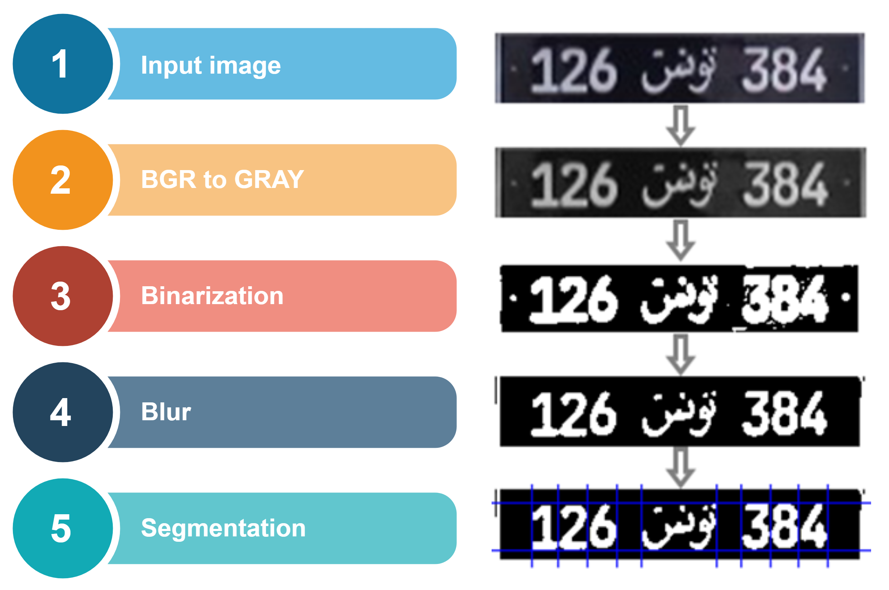
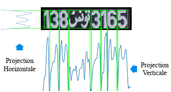
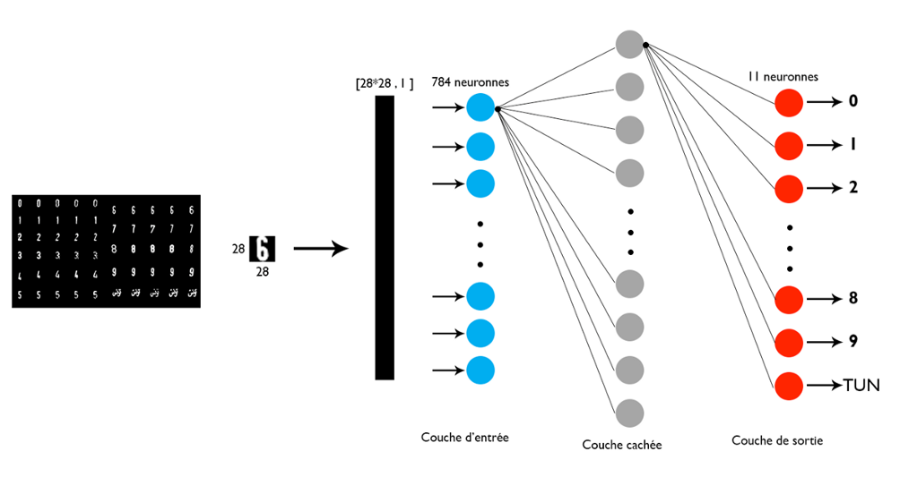

Problem statement Description:
                                Many residential society administrations, tolls, business complexes and parking spaces in India lack an automated system for car parking and vehicle monitoring. Most of the commercial and residential places face an impending problem of illegal car/vehicle parking inside their premises. This issue is not bounded to just parking, but also adds to the security concerns inside those establishments. Though there are solutions that exist in the market, the affordability comes into question. In this regard, we would like to have an affordable solution that caters to the Indian markets Expectation: For the team choosing this topic, we expect to have a working model / infrastructure of the solution wherein, when a vehicle passes through a checkpost and the solution identifies as many features as it can regard the situation of the vehicle. All Teams will be provided with an amount of video footage. The teams must build a fictitious database based on the vehicles appearing in footage and demonstrate the problems that they are able to solve/automate in existing infrastructure.


Solution idea -
                To solve the problem of vehicle security and surveillance we have develop a Smart &amp; Secure Parking System, this system can be implement at various location, like residential society administrations, tolls, business complexes and parking spaces in India lack an automated system for car parking and vehicle monitoring. Most of the commercial and residential places face an impending problem of illegal car/vehicle parking inside their premises.

Process of our system working are mention below:

1. Take frames of vehicle from video footage at runtime by machine learning vehicle detection model.
2. Extract the Number Plate from the vehicle image.
3. Apply segmentation to make it readable for OCR.
4. Recognize the text from the Number Plate.
5. Now, compare the text with our daily database to make sure that vehicle is known or visitors.
6. If vehicle new than add this vehicle entry in daily database.
7. Generate a unique Approval ID by system and print on receipt for unique identification of vehicle. (Security purpose)
8. Then, compare it with the RTO database for Number Plate Verification and Stolen vehicle database and take action base on        result that if some fraud found then informs to nearby police station otherwise it’s valid.
9. Scan QR code from receipt to done parking payment fee by driver. (After park vehicle in parking but before exit)
10. Vehicle exit from parking - if the vehicle payment is done than automatically gate open else that is invalid access.


We required three databases:
1. Daily Database - Stored data of daily passes vehicle.
2. RTO database - Data for verification of Vehicle Number Plate from Govt. Website
http://vahan.nic.in/nrservices/faces/user/searchstatus.xhtml
3. Stolen database - Stored data of stolen vehicle detail http://164.100.44.112/vahansamanvay/Internetquery.aspx


# Import all the necessary libraries


```python
import numpy as np
import os
import pytesseract
import cv2
import matplotlib.pyplot as plt
%matplotlib inline
pytesseract.pytesseract.tesseract_cmd = r'C:/Program Files/Tesseract-OCR/tesseract.exe'
```

Library numpy for image processing like size, type etc.<br>
Library Computer-Vision 2(cv2) for image read, write, show, grayscale, binarization, blurization etc.<br>
Liprary Matplotlib used for image showing.<br>
Library Pytesseract used for converting image to text.<br>
Library Os used for storing data in directory.<br>

## Step - 1  Vehicle detection from video 


```python
cap = cv2.VideoCapture(r'C:\Users\Insafo\Desktop\work\video.avi')
  

car_cascade = cv2.CascadeClassifier(r'C:\Users\Insafo\Desktop\work\vehicle_detection.xml')
while True:
    
    ret, frames = cap.read()
      
   
    gray = cv2.cvtColor(frames, cv2.COLOR_BGR2GRAY)
         
    cars = car_cascade.detectMultiScale(gray, 1.1, 1)
      
   
    for (x,y,w,h) in cars:
        cv2.rectangle(frames,(x,y),(x+w,y+h),(0,255,0),2)
        roi_color = frames[y:y+h, x:x+w]
    print("[INFO] Object found. Saving locally.")
    cv2.imwrite(str(w) + str(h) + '_faces.jpg', roi_color)

    status = cv2.imwrite('faces_detected.jpg', frames)
    print("[INFO] Image faces_detected.jpg written to filesystem: ", status)
  
    
    cv2.imshow('vehicle_detection', frames)
      
    
    if cv2.waitKey(33) == 27:
        break
cv2.destroyAllWindows()
```

We used Indian Vehicle Detection .Xml pre-trained model(Vehicle_detection.xml)<br>
All detected vehicle in video stores in pwd(Present working directory) 

## Step -2  Number Plate Detection From vehicle Detection


```python

 
cap = cv2.VideoCapture(r'C:/Users/user/Desktop/work/video.mp4')
 
  
 # Trained XML classifiers describes some features of some object we want to detect 
car_cascade = cv2.CascadeClassifier(r'C:/Users/user/Desktop/work/india_license_plate.xml') 
  

currentframe = 0
while True:
    
    ret, frames = cap.read() 
      
   
    gray = cv2.cvtColor(frames, cv2.COLOR_BGR2GRAY) 
      
  
     
    cars = car_cascade.detectMultiScale(gray, 1.1, 1) 
      
    
    for (x,y,w,h) in cars: 
        plate = cv2.rectangle(frames,(x,y),(x+w,y+h),(0,255,255),2)
        
        ro = frames[y:y+h,x:x+w]
        #cv2.imshow('ss',ro)
        gray2 = cv2.cvtColor(ro,cv2.COLOR_BGR2GRAY)
        ret, gray3 = cv2.threshold(gray2,150,255, cv2.THRESH_BINARY)
        
        
        
        cars2 =car_cascade.detectMultiScale(gray3, 1.1, 1)
        for (a,b,c,d) in cars2:
            cv2.rectangle(ro,(a,b),(a+c,b+d),(0,255,255),2)
            ro2=ro[b:b+d,a:a+c]
            ro4 = cv2.cvtColor(ro2,cv2.COLOR_BGR2GRAY)
            ret, gray4 = cv2.threshold(ro4,127,255, cv2.THRESH_BINARY)
            cv2.imshow('number_plate',gray4)
            
  
   
    cv2.imshow('number_plate', frames)

     
    
    currentframe += 1

    if cv2.waitKey(33) == 27: 
        break
  
 # De-allocate any associated memory usage 
cv2.destroyAllWindows() 
```

We used Indian Vehicle Number Plate Detection .Xml pre-trained model(Number_Plate_detection.xml).<br>
In this step we used two nested for loops for improving the accuracy of number plates.


## Step - 3 Text recognition From Detected Number plate


```python

 
cap = cv2.VideoCapture(r'C:/Users/user/Desktop/work/video.mp4')
 
  
 # Trained XML classifiers describes some features of some object we want to detect 
car_cascade = cv2.CascadeClassifier(r'C:/Users/user/Desktop/work/india_license_plate.xml') 
  

currentframe = 0
while True:
    
    ret, frames = cap.read() 
      
   
    gray = cv2.cvtColor(frames, cv2.COLOR_BGR2GRAY) 
      
  
     
    cars = car_cascade.detectMultiScale(gray, 1.1, 1) 
      
    
    for (x,y,w,h) in cars: 
        plate = cv2.rectangle(frames,(x,y),(x+w,y+h),(0,255,255),2)
        
        ro = frames[y:y+h,x:x+w]
        gray2 = cv2.cvtColor(ro,cv2.COLOR_BGR2GRAY)
        ret, gray3 = cv2.threshold(gray2,150,255, cv2.THRESH_BINARY)
        
        
        
        cars2 =car_cascade.detectMultiScale(gray3, 1.1, 1)
        for (a,b,c,d) in cars2:
            cv2.rectangle(ro,(a,b),(a+c,b+d),(0,255,255),2)
            ro2=ro[b:b+d,a:a+c]
            ro4 = cv2.cvtColor(ro2,cv2.COLOR_BGR2GRAY)
            ret, gray4 = cv2.threshold(ro4,127,255, cv2.THRESH_BINARY)
            time.sleep(0.1)
            text=pytesseract.image_to_string(ro,lang='eng')
            print(text)
     
    currentframe += 1
 
    if cv2.waitKey(33) == 27: 
        break
  
 # De-allocate any associated memory usage 
cv2.destroyAllWindows() 
```

Pre-defined function pytesseract.image_to_string() for recognition text form image.

## Future work

We have divided this project model into three steps.<br>
Step - 1 accuracy is around 96%<br>
Step - 2 accuracy is around 90%<br>
Step - 3 accuracy is low as compare to above step.<br>
we improve step - 3 accuracy by following our future work.<br>

Now we have to segment our plate number. The input is the image of the plate, we will have to be able to extract the unicharacter images. The result of this step, being used as input to the recognition phase, is of great importance. In a system of automatic reading of number plates.<br>

Segmentation is one of the most important processes for the automatic identification of license plates, because any other step is based on it. If the segmentation fails, recognition phase will not be correct.To ensure proper segmentation, preliminary processing will have to be performed.<br>


The histogram of pixel projection consists of finding the upper and lower limits, left and right of each character. We perform a horizontal projection to find the top and bottom positions of the characters. The value of a group of histograms is the sum of the white pixels along a particular line in the horizontal direction. When all the values ​​along all the lines in the horizontal direction are calculated, the horizontal projection histogram is obtained. The average value of the histogram is then used as a threshold to determine the upper and lower limits. The central area whose segment of the histogram is greater than the threshold is recorded as the area delimited by the upper and lower limits. Then in the same way we calculate the vertical projection histogram but by changing the rows by the columns of the image to have the two limits of each character (left and right).<br>


Another approach to extract digits from licence plate is to use open/close morphologye to make some sorte of connected region then use connected component algorithm to extract connected regions.<br>


The recognition phase is the last step in the development of the automatic license plate reader system. Thus, it closes all the processes passing by the acquisition of the image, followed by the location of the plate until the segmentation. The recognition must make from the images characters obtained at the end of the segmentation phase. The learning model that will be used for this recognition must be able to read an image and to render the corresponding character.
In order to make the most of the data available for learning, we cut each character indivudually by resizing it in a square after applying the same image processing steps used before segmentation of the license plate. As a result, we obtained a set of of data composed of 11 classes and for each class we have 30–40 images of 28X28 pixel dimesion PNG formats; numbers from 0 to 9 and the word in Arabic (Tunisia).<br>


Then, we made some researches based on scientific articles that compare the multilayer perceptron (MLP) and the classifier K nearest neighbors (KNN). And as a result we have found that: performance is increased if the number of hidden layer neurons is also increased when using the MLP classifier and if the nearest neighbor number is also increased when using the KNN. the ability to adjust the performance of the k-NN classifier is very limited here. But an adjustable number of hidden layers and adjustable MLP connection weights provides a greater opportunity to refine the decision regions. So as a result, we will choose the multilayer perceptron for this phase.<br>


